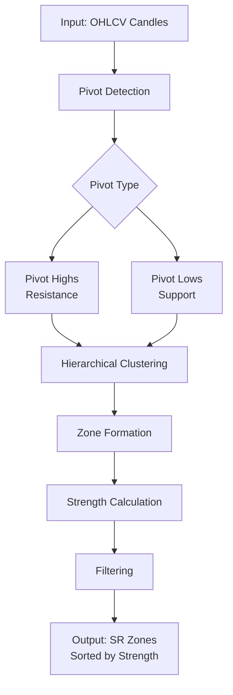
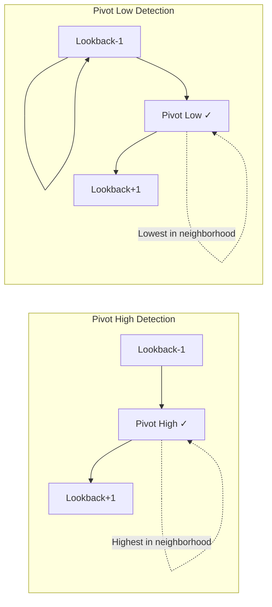
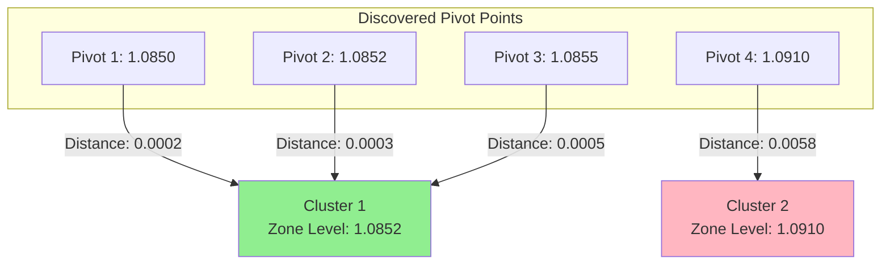
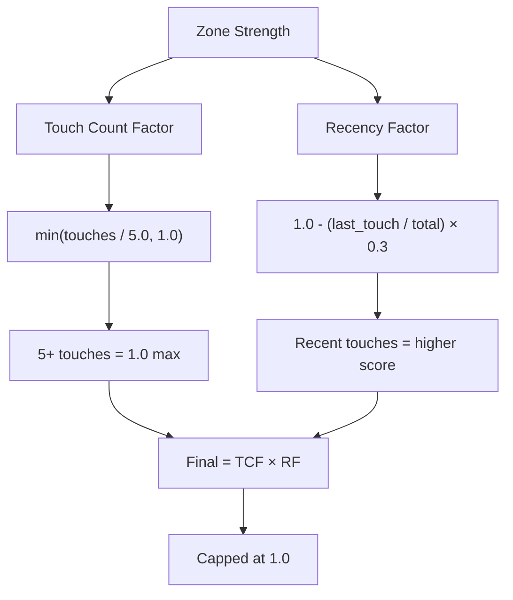
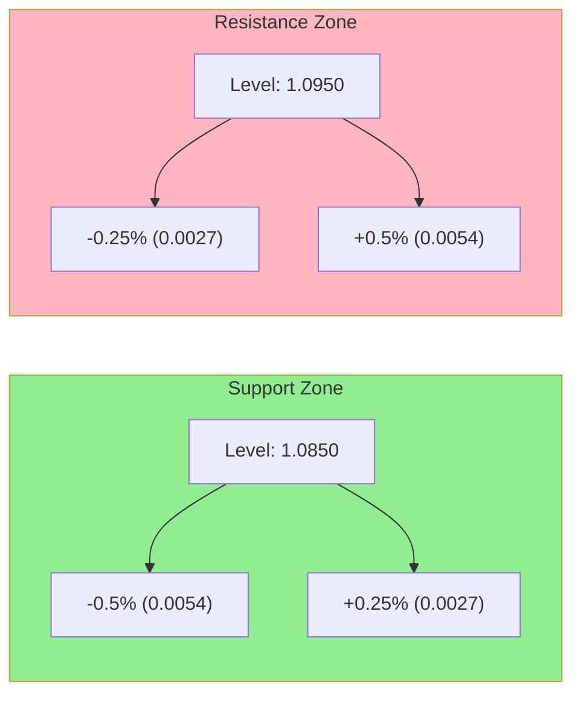
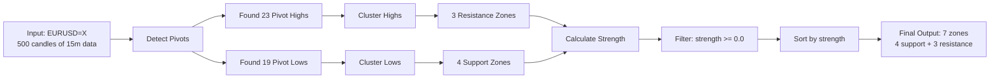

# Naked Forex API

> A professional FastAPI application implementing the Nick Shawn "Naked Forex" trading framework with automated pattern detection, trade journaling, and real-time Discord alerts.

## Features

- **Pattern Detection**: Algorithmic detection of Three Pulse exhaustion patterns and Big Wick candlestick setups
- **Support/Resistance Zones**: Automated identification using pivot point analysis and hierarchical clustering
- **Trade Journaling**: "Series of 10" tracking system with performance statistics and expectancy calculations
- **Interactive Charts**: Plotly-based visualizations with S/R zones and signal annotations
- **Discord Bot**: Real-time alerts for A+ setups with manual scanning commands
- **JWT Authentication**: Secure user authentication with role-based access control
- **REST API**: Professional OpenAPI/Swagger documentation

## Trading Strategy

Based on the Nick Shawn "Naked Forex" methodology:

- **50/50 Market Theory**: Markets are probabilistic, not predictive
- **Price Action**: Pure OHLCV analysis without lagging indicators
- **Three Pulse Cycle**: Identifies momentum exhaustion after 3 pushes
- **Big Wick Trigger**: Entry signals with wick-to-body ratio ≥ 3:1
- **1:1 Risk-Reward**: Conservative RR targets for consistent profitability
- **Series of 10**: Performance evaluation in blocks of 10 trades

## Support and Resistance Zone Detection

### Algorithm Overview

The support and resistance zone detection uses a **two-step process** based on pure price action analysis:



**Key characteristics:**
- No lagging indicators - pure OHLCV analysis
- Statistical approach using hierarchical clustering
- Quantifiable strength metrics (0.0 to 1.0)
- Automatic zone consolidation

### Step 1: Pivot Point Detection

The algorithm identifies local highs and lows using a **neighborhood search**:



**How it works:**
- Scans through OHLCV candles with a configurable lookback period (default: **5 candles**)
- For each candle, checks if its high/low is the highest/lowest in its neighborhood
- A pivot high is found when no neighboring candle has a higher price (resistance)
- A pivot low is found when no neighboring candle has a lower price (support)

**Configuration:**
- `MIN_PIVOT_LOOKBACK`: 5 candles (adjustable: 3-20)
- More lookback = fewer but more reliable pivots
- Less lookback = more pivots but higher noise

### Step 2: Hierarchical Clustering

Pivot points are grouped into zones using **agglomerative clustering**:



**Clustering parameters:**
- **Distance Threshold**: `avg_price × sensitivity` (default: 5%)
- **Method**: Agglomerative clustering with average linkage
- **Minimum touches**: 2+ pivots required to form a zone
- **Zone level**: Average price of all pivots in the cluster

**Example calculation:**
```
Price: 1.0850
Sensitivity: 0.05 (5%)
Threshold: 1.0850 × 0.05 = 0.0543

Pivots within ±0.0543 are grouped into the same zone
```

### Zone Strength Calculation

Each zone receives a **strength score** (0.0 to 1.0) based on two factors:



**Formula:**
```python
strength = min(touches / 5.0, 1.0) × (1.0 - (last_touch_index / total_candles) × 0.3)
```

**Factors explained:**

| Factor | Weight | Description |
|--------|--------|-------------|
| Touch Count | Primary | 5+ touches = maximum strength (1.0) |
| Recency | Secondary (30%) | More recent touches increase strength |
| Range | 0.0 - 1.0 | Higher = more reliable zone |

**Strength interpretation:**
- **> 0.7**: Strong zone (major support/resistance)
- **0.4 - 0.7**: Moderate zone (potential turning point)
- **< 0.4**: Weak zone (use with caution)

### Detailed Algorithm Breakdown

#### Complete Detection Flow

```mermaid
flowchart TD
    A[Start: MarketData Input] --> B{Data Available?}
    B -->|No| Z[Return Empty List]
    B -->|Yes| C[Find Pivot Highs]
    A --> D[Find Pivot Lows]

    C --> E[Loop: i from lookback to len - lookback]
    D --> F[Loop: i from lookback to len - lookback]

    E --> G{Current High > Neighborhood?}
    F --> H{Current Low < Neighborhood?}

    G -->|Yes| I[Add to Pivot Highs]
    H -->|Yes| J[Add to Pivot Lows]

    I --> K[Extract Prices]
    J --> K
    G -->|No| E
    H -->|No| F

    K --> L[Calculate: avg_price × sensitivity]
    L --> M[Distance Threshold]

    M --> N[Agglomerative Clustering<br/>linkage='average']
    N --> O{Clustering Success?}

    O -->|No| P[Fallback: Each pivot = zone]
    O -->|Yes| Q[Group pivots by cluster label]

    P --> R{Touches >= min_touches?}
    Q --> R

    R -->|No| S[Skip zone]
    R -->|Yes| T[Calculate zone level = avg(pivots)]

    T --> U[Calculate strength]
    U --> V[Check if fresh zone]
    V --> W[Create SRZone object]

    W --> X[Filter by min_strength]
    X --> Y[Sort by strength descending]
    Y --> AA[Return zones list]
```

#### Algorithm Steps (with Code References)

**1. Initialize Detection Service** ([sr_detection.py:29-52](app/services/sr_detection.py#L29-L52))
```python
service = SRDetectionService(
    sensitivity=0.05,      # 5% distance threshold
    min_touches=2,         # Minimum 2 pivots per zone
    lookback_pivots=5      # Check 5 candles on each side
)
```

**2. Pivot Detection - Detailed Process** ([sr_detection.py:111-187](app/services/sr_detection.py#L111-L187))

For each candle in the dataset (excluding edges):

```python
# Pivot High Detection (for resistance zones)
for i in range(lookback, len(candles) - lookback):
    current = candles[i]
    is_pivot = True

    # Check neighborhood (i-lookback to i+lookback)
    for j in range(i - lookback, i + lookback + 1):
        if candles[j].high > current.high:
            is_pivot = False
            break

    if is_pivot:
        pivots.append({
            'price': current.high,
            'timestamp': current.timestamp,
            'index': i
        })
```

**Example with lookback=5:**
```
Candle Index:      0    1    2    3    4    5    6    7    8    9   10
High Price:     1.08 1.09 1.10 1.08 1.07 1.12 1.09 1.08 1.07 1.06 1.10
                                                ^
                                           Checking this candle

Neighborhood:  0-4 (left) + 6-10 (right) = 10 candles to compare
Candle 5 (1.12) > all neighbors → PIVOT HIGH found
```

**3. Hierarchical Clustering** ([sr_detection.py:189-272](app/services/sr_detection.py#L189-L272))

Uses scikit-learn's `AgglomerativeClustering`:

```python
from sklearn.cluster import AgglomerativeClustering

# Calculate distance threshold
avg_price = np.mean(prices)  # e.g., 1.0850
distance_threshold = avg_price * sensitivity  # 1.0850 × 0.05 = 0.0543

# Initialize clustering
clustering = AgglomerativeClustering(
    n_clusters=None,              # Let algorithm determine
    distance_threshold=0.0543,    # Max distance to merge
    linkage='average'             # Average distance between clusters
)

labels = clustering.fit_predict(prices)
```

**How linkage='average' works:**
- Measures distance between all pairs of points in two clusters
- Uses the average of these distances
- Merges clusters when average distance < threshold

**Example clustering:**
```
Pivot highs: [1.0850, 1.0852, 1.0910, 1.0855, 1.0950]
Average price: 1.08834
Threshold: 1.08834 × 0.05 = 0.0544

Distance matrix:
          1.0850   1.0852   1.0910   1.0855   1.0950
1.0850      0      0.0002   0.0060   0.0005   0.0100
1.0852    0.0002     0      0.0058   0.0003   0.0098
1.0910    0.0060   0.0058      0      0.0055   0.0040
1.0855    0.0005   0.0003   0.0055      0      0.0095
1.0950    0.0100   0.0098   0.0040   0.0095      0

All distances < 0.0544 → ALL merge into ONE cluster
Zone level = avg([1.0850, 1.0852, 1.0910, 1.0855, 1.0950]) = 1.08834
```

**4. Zone Filtering**

Zones are filtered by two criteria:

```python
# Filter by minimum touches
if len(cluster_pivots) < min_touches:  # Default: 2
    continue  # Skip this zone

# Filter by minimum strength
if zone.strength < min_strength:  # User-defined (default: 0.0)
    filtered_zones.remove(zone)
```

### Zone Width Calculation

Zones have asymmetric width based on type ([signals.py:58-76](app/models/signals.py#L58-L76)):



**Calculation example:**
```python
# Support zone at 1.0850
level = 1.0850
zone_width_percent = 0.005  # 0.5%

half_width = level * zone_width_percent  # 1.0850 × 0.005 = 0.0054

# Support extends MORE below (buyers defend from below)
lower_bound = level - half_width           # 1.0850 - 0.0054 = 1.0796
upper_bound = level + half_width * 0.5     # 1.0850 + 0.0027 = 1.0877
price_range = (1.0796, 1.0877)

# Resistance zone at 1.0950
# Resistance extends MORE above (sellers defend from above)
lower_bound = level - half_width * 0.5     # 1.0950 - 0.0027 = 1.0923
upper_bound = level + half_width           # 1.0950 + 0.0054 = 1.1004
price_range = (1.0923, 1.1004)
```

**Why asymmetric?**
- **Support**: Buyers step in more aggressively below the level
- **Resistance**: Sellers defend more aggressively above the level

### Tuning SR Zone Detection

The SR detection system uses **ATR-based dynamic thresholds** that adapt to market volatility. This section explains how to tune the parameters for your specific trading style.

#### The Trial-and-Error Process

Finding optimal parameters is an iterative process. Here's a systematic approach:

**Step 1: Start with Balanced Profile**
```bash
# Default settings (0.5 ATR zone width, 0.3 ATR sensitivity)
POST /api/v1/analysis/zones
{
  "ticker": "EURUSD=X",
  "timeframe": "15m",
  "sr_detection_profile": "balanced"
}
```

**Step 2: Evaluate Zone Quality**

Check the detected zones and look for:
- **Too many zones** (>15): Zones are overlapping or too narrow
- **Too few zones** (<3): Missing important support/resistance levels
- **Zones too wide**: Price can move significantly within zone (poor entry precision)
- **Zones too narrow**: Price rarely touches zones (missed opportunities)

**Step 3: Adjust zone_width_atr_multiplier**

This parameter controls zone width (buffer around central level):

| Value | Zone Width | Use Case |
|-------|-----------|----------|
| 0.3 ATR | Narrow | Scalping, precise entries |
| 0.5 ATR | Medium | **Default**, balanced trading |
| 0.7 ATR | Wide | Swing trading, conservative entries |

**Example progression from real testing:**
```
# Too narrow → zones missed
zone_width_atr_multiplier: 0.08
Result: ~6 pips total width, price rarely enters zones

# Too narrow → zones missed
zone_width_atr_multiplier: 0.12
Result: ~10 pips total width, still too narrow

# Too narrow → zones missed
zone_width_atr_multiplier: 0.20
Result: ~16 pips total width, still too narrow

# Too narrow → price wicks through
zone_width_atr_multiplier: 0.35
Result: ~28 pips total width, price wicks through zones

# Just right → balanced
zone_width_atr_multiplier: 0.5
Result: ~40 pips total width, zones catch price reversals well
```

**Step 4: Adjust sensitivity_atr_multiplier**

This parameter controls how close pivots must be to cluster into a zone:

| Value | Clustering | Result |
|-------|-----------|--------|
| 0.2 ATR | Tight | More zones (may overlap) |
| 0.3 ATR | Medium | **Default**, balanced |
| 0.4 ATR | Loose | Fewer zones (major levels only) |

**Interaction between parameters:**
- `sensitivity_atr_multiplier` → determines if pivots cluster into zones
- `zone_width_atr_multiplier` → determines zone buffer after clustering

**Example tuning session:**

```python
# Initial: Too many zones (23 detected)
sensitivity_atr_multiplier: 0.2
zone_width_atr_multiplier: 0.3

# Iteration 1: Tighten clustering (15 detected)
sensitivity_atr_multiplier: 0.3
zone_width_atr_multiplier: 0.3

# Iteration 2: Widen zones (7 detected, well-spaced)
sensitivity_atr_multiplier: 0.3
zone_width_atr_multiplier: 0.5  # ← Final balanced settings
```

#### Parameter Interaction Guide

**When zones overlap significantly:**
1. Increase `sensitivity_atr_multiplier` (tighter clustering)
2. Increase `overlap_removal_threshold` (stricter filtering)

**When zones are too narrow:**
1. Increase `zone_width_atr_multiplier`
2. Check if `min_zone_strength` is filtering too aggressively

**When zones are too wide:**
1. Decrease `zone_width_atr_multiplier`
2. Consider using "conservative" profile

**When missing key levels:**
1. Decrease `sensitivity_atr_multiplier` (looser clustering)
2. Decrease `min_pivot_distance_bars` (more pivots)
3. Decrease `min_zone_touches` (e.g., from 3 to 2)

#### Quick Reference

**For Scalping (1m-5m timeframes):**
- Profile: `aggressive`
- Expected zones: 10-20
- Zone width: ~24 pips (0.3 ATR)

**For Swing Trading (15m-1h timeframes):**
- Profile: `balanced`
- Expected zones: 5-10
- Zone width: ~40 pips (0.5 ATR)

**For Position Trading (4h-Daily timeframes):**
- Profile: `conservative`
- Expected zones: 3-6
- Zone width: ~56 pips (0.7 ATR)

### Zone Matching Methods

The SRZone class provides utility methods for price-zone interaction ([signals.py:83-106](app/models/signals.py#L83-L106)):

#### `contains_price(price)` - Check if price is within zone

```python
zone = SRZone(level=1.0850, zone_type=ZoneType.SUPPORT)
# price_range = (1.0796, 1.0877)

zone.contains_price(1.0830)  # True - within support zone
zone.contains_price(1.0900)  # False - above support zone
zone.contains_price(1.0750)  # False - below support zone
```

#### `distance_to_price(price)` - Calculate distance from zone center

```python
zone.distance_to_price(1.0900)  # +0.0050 (price is above zone)
zone.distance_to_price(1.0800)  # -0.0050 (price is below zone)
zone.distance_to_price(1.0850)  # 0.0000 (price at zone center)
```

#### `find_nearby_zone(price, zones, tolerance)` - Find zone near price ([sr_detection.py:326-354](app/services/sr_detection.py#L326-L354))

```python
service = SRDetectionService()
zones = await service.detect_zones(data)

# Find zone near current price (1.0835)
nearby_zone = service.find_nearby_zone(
    price=1.0835,
    zones=zones,
    tolerance=0.005  # Optional: uses sensitivity if None
)

# Returns SRZone if found, None otherwise
```

### Complete Example Walkthrough

Let's trace through a complete detection with actual values:



**Sample output:**
```python
[
    SRZone(
        level=1.0923,
        zone_type=ZoneType.RESISTANCE,
        strength=0.85,          # Strong zone
        touches=5,              # 5 pivot highs clustered
        is_fresh=False,         # Last touch 45 bars ago
        price_range=(1.0906, 1.0940)
    ),
    SRZone(
        level=1.0850,
        zone_type=ZoneType.SUPPORT,
        strength=0.72,          # Strong zone
        touches=4,
        is_fresh=True,          # Last touch 150 bars ago
        price_range=(1.0796, 1.0877)
    ),
    SRZone(
        level=1.0750,
        zone_type=ZoneType.SUPPORT,
        strength=0.45,          # Moderate zone
        touches=2,              # Minimum touches
        is_fresh=True,
        price_range=(1.0696, 1.0777)
    ),
    # ... additional zones
]
```

### Edge Cases and Error Handling

**1. Insufficient Data**
```python
# Less than 2×lookback candles needed
if len(candles) < lookback * 2:
    return []  # Cannot detect pivots at edges
```

**2. Clustering Failure**
```python
try:
    labels = clustering.fit_predict(prices)
except Exception as e:
    logger.warning(f"Clustering failed: {e}")
    labels = list(range(len(pivots)))  # Each pivot = separate zone
```

**3. No Zones Found**
```python
if not filtered_zones:
    logger.info("No zones found - try adjusting sensitivity")
    return []
```

**4. Single Pivot Handling**
```python
# Single pivot with min_touches=2 → filtered out
# Either reduce min_touches or provide more data
```

### Zone Properties

Each detected zone includes the following properties:

| Property | Type | Description |
|----------|------|-------------|
| `level` | float | Central price of the zone (average of clustered pivots) |
| `zone_type` | enum | `SUPPORT` or `RESISTANCE` |
| `strength` | float | Confidence score (0.0 to 1.0) |
| `touches` | int | Number of pivot touches that formed the zone |
| `last_touch_date` | datetime | Most recent touch timestamp |
| `price_range` | tuple | (lower_bound, upper_bound) at ±zone_width_percent |
| `is_strong` | bool | True if strength > 0.7 |
| `is_fresh` | bool | True if last touch > 100 bars ago |

**Zone width:** Default ±0.5% from the central level (configurable)

### Configuration Parameters

Key settings for SR zone detection ([app/config/constants.py](app/config/constants.py)):

| Parameter | Default | Range | Description |
|-----------|---------|-------|-------------|
| `SR_SENSITIVITY` | 0.05 (5%) | 0.01 - 0.2 | Price distance to cluster into zones |
| `MIN_PIVOT_LOOKBACK` | 5 candles | 3 - 20 | Neighborhood size for pivot detection |
| `MIN_ZONE_TOUCHES` | 2 pivots | 1 - 10 | Minimum pivots to form a zone |
| `FRESH_ZONE_THRESHOLD` | 100 bars | 10 - 500 | Bars since touch for "fresh" zone |
| `ZONE_WIDTH_PERCENT` | 0.5% | 0.1% - 2% | Width above/below zone level |

**Tuning guidelines:**
- **Lower sensitivity** (0.01-0.03): More zones, higher noise, suitable for scalping
- **Higher sensitivity** (0.08-0.15): Fewer zones, cleaner signals, suitable for swing trading
- **Lower lookback** (3-5): More pivots, more zones, faster detection
- **Higher lookback** (8-15): Fewer pivots, major zones only, slower detection

### Advanced SR Detection Features

#### ATR-Based Dynamic Thresholds

**Why ATR is better than fixed percentages:**

Fixed percentage thresholds (e.g., 5% of price) create inconsistent zone widths across different assets and volatility regimes:

```
# Fixed 5% threshold (problematic)
BTC at $50,000: Zone width = $2,500  ← Too wide!
EUR/USD at 1.0850: Zone width = 0.0543  ← Reasonable
```

ATR (Average True Range) adapts to current market volatility:

```
# ATR-based threshold (adaptive)
BTC (ATR = $1,000): Zone width = 0.5 × $1,000 = $500  ← Appropriate
EUR/USD (ATR = 0.0030): Zone width = 0.5 × 0.0030 = 0.0015  ← Appropriate
```

**How it works:**

1. Calculate 14-period ATR (average volatility)
2. Cluster pivots within `sensitivity_atr_multiplier × ATR`
3. Create zone with width `zone_width_atr_multiplier × ATR`

**Configuration:**
```python
use_atr_thresholds: True  # Enable ATR-based mode
sensitivity_atr_multiplier: 0.3  # Clustering threshold (0.3 × ATR)
zone_width_atr_multiplier: 0.5  # Zone width (0.5 × ATR)
atr_period: 14  # ATR calculation period
```

#### Psychological Level Detection

The algorithm automatically boosts strength for zones near round numbers (e.g., 1.1000, 1.0500, 1.0000).

**Why it matters:**
Traders place orders at psychological levels, creating real support/resistance.

**How it works:**
```python
# Check proximity to round numbers
round_number_proximity: 0.001  # 0.1% threshold

# Examples:
1.0850 → 1.1000: Within 1.4% → 10% strength boost
1.0850 → 1.0500: Within 3.2% → No boost
1.5000 → Exact .50 level → 10% strength boost
```

**Configuration:**
```python
round_number_proximity: 0.001  # Boost if within 0.1% of round number
```

#### Zone Overlap Removal

Prevents cluttered charts by removing overlapping zones (keeps stronger zones).

**Algorithm:**
1. Sort zones by strength (descending)
2. For each zone, check overlap with previously kept zones
3. If overlap > 70% of smaller zone, discard it

**Example:**
```
Zone 1: [1.0840 - 1.0860], strength: 0.85  ← Keep
Zone 2: [1.0845 - 1.0865], strength: 0.65  ← Overlaps 75% with Zone 1, discard
Zone 3: [1.0890 - 1.0910], strength: 0.72  ← No overlap, keep
```

**Configuration:**
```python
overlap_removal_threshold: 0.7  # Remove if 70%+ overlap
```

#### Strength Calculation with Weights

Zone strength combines multiple factors:

**Formula:**
```python
strength = (
    touch_score × touch_weight +      # Touch count (0-1)
    recency_score × recency_weight +  # Time decay (0-1)
    time_span_score × 0.2             # Persistence (0-1)
)

touch_score = min(touches / 5.0, 1.0)  # 5+ touches = max score
recency_score = exp(-bars_ago / 100)   # Exponential decay
time_span_score = min((last_idx - first_idx) / total_candles × 2, 1.0)
```

**Factor weights:**
```python
recency_weight: 0.4  # 40% weight to recency
touch_weight: 0.6    # 60% weight to touch count
```

**Example calculation:**
```
Zone with 4 touches, last touch 50 bars ago, span 200 bars:
touch_score = 4/5 = 0.8
recency_score = exp(-50/100) = 0.61
time_span_score = 200/500 × 2 = 0.8

strength = 0.8 × 0.6 + 0.61 × 0.4 + 0.8 × 0.2
strength = 0.48 + 0.244 + 0.16 = 0.88
```

#### Volume Confirmation (Optional)

Require pivots to have above-average volume (disabled by default).

**Configuration:**
```python
use_volume_confirmation: False  # Disabled by default
volume_confirmation_threshold: 0.5  # Require 50% of average volume
```

**Note:** Most forex pairs don't have reliable volume data. This feature is useful for stocks and crypto.

#### Zone Freshness

Fresh zones are those tested recently but not too recently:

```python
is_fresh = 10 < bars_ago < fresh_zone_threshold
```

**Example:**
```
fresh_zone_threshold: 100

Zone touched 5 bars ago → Not fresh (too recent, price still at zone)
Zone touched 50 bars ago → Fresh (price left and may return)
Zone touched 200 bars ago → Not fresh (stale, zone may have broken)
```

**Configuration:**
```python
fresh_zone_threshold: 100  # Bars since touch for "fresh" zone
```

### Preset Detection Profiles

The system includes three pre-configured profiles for different trading styles:

#### Balanced Profile (Default)

Best for: **Swing trading, 15m-1h timeframes**

```python
{
  "sensitivity_atr_multiplier": 0.3,  # Moderate clustering
  "zone_width_atr_multiplier": 0.5,  # Medium zone width
  "min_pivot_distance_bars": 5,      # Moderate pivot filtering
  "min_zone_strength": 0.0,          # Accept all zones
  "min_zone_touches": 2,             # Minimum 2 touches
  "min_pivot_lookback": 5            # Standard lookback
}
```

**Characteristics:**
- 5-10 zones detected on 15m timeframe
- Balanced between precision and coverage
- Works well for most forex pairs
- **Default profile** - used when no profile specified

**Usage:**
```bash
POST /api/v1/analysis/zones
{
  "ticker": "EURUSD=X",
  "timeframe": "15m",
  "sr_detection_profile": "balanced"
}

# OR simply omit the parameter (balanced is default)
POST /api/v1/analysis/zones
{
  "ticker": "EURUSD=X",
  "timeframe": "15m"
}
```

#### Conservative Profile

Best for: **Position trading, higher timeframes (4h, daily)**

```python
{
  "sensitivity_atr_multiplier": 0.4,  # Loose clustering
  "zone_width_atr_multiplier": 0.7,  # Wide zone buffer
  "min_pivot_distance_bars": 10,     # Strict pivot filtering
  "min_zone_strength": 0.4,          # Filter weak zones
  "min_zone_touches": 3,             # Require 3+ touches
  "min_pivot_lookback": 7            # Larger lookback
}
```

**Characteristics:**
- 3-6 zones detected (major levels only)
- Wide zones provide entry flexibility
- Higher minimum strength reduces false signals
- Best for longer-term trades where precision matters less than zone validity

**Usage:**
```bash
POST /api/v1/analysis/zones
{
  "ticker": "XAUUSD=X",
  "timeframe": "4h",
  "sr_detection_profile": "conservative"
}
```

#### Aggressive Profile

Best for: **Scalping, lower timeframes (1m, 5m)**

```python
{
  "sensitivity_atr_multiplier": 0.2,  # Very tight clustering
  "zone_width_atr_multiplier": 0.3,  # Narrow zone width
  "min_pivot_distance_bars": 3,      # Permissive pivot filtering
  "min_zone_strength": 0.0,          # Accept all zones
  "min_zone_touches": 2,             # Minimum 2 touches
  "min_pivot_lookback": 3,           # Small lookback
  "fresh_zone_threshold": 50         # Shorter fresh window
}
```

**Characteristics:**
- 10-20 zones detected (more opportunities)
- Narrow zones require precise entries
- Shorter fresh window (50 bars) for recent zones
- Best for active traders who want more trading opportunities

**Usage:**
```bash
POST /api/v1/analysis/zones
{
  "ticker": "EURUSD=X",
  "timeframe": "5m",
  "sr_detection_profile": "aggressive"
}
```

#### Custom Profiles

Override specific parameters while keeping preset as base:

```bash
# Use balanced profile but override zone width
POST /api/v1/analysis/zones
{
  "ticker": "EURUSD=X",
  "sr_detection_profile": "balanced",
  "sr_sensitivity": 0.03  # Override sensitivity only
}
```

Or set default profile via environment variable:

```bash
# .env file
SR_DETECTION_PROFILE=conservative
```

### Code References

- **Pivot Detection**: [app/services/sr_detection.py:111-187](app/services/sr_detection.py#L111-L187)
- **Clustering Algorithm**: [app/services/sr_detection.py:189-272](app/services/sr_detection.py#L189-L272)
- **Strength Calculation**: [app/services/sr_detection.py:274-302](app/services/sr_detection.py#L274-L302)
- **SR Zone Model**: [app/models/signals.py:16-107](app/models/signals.py#L16-L107)
- **Configuration**: [app/config/constants.py:76-84](app/config/constants.py#L76-L84)

## Quick Start

### Prerequisites

- Python 3.14+
- [uv](https://docs.astral.sh/uv/) package manager (recommended) OR standard venv

### Installation

#### Option 1: Using uv (Recommended)

```bash
# Install dependencies (uv will use Python 3.14 from .python-version file)
uv sync

# OR if you need to specify Python version explicitly:
uv sync --python 3.14

# Create .env from template
cp .env.example .env

# Update .env with your settings
# - Generate a secure SECRET_KEY
# - Add Discord token (optional)
# - Configure trading parameters

# Initialize database
uv run python scripts/init_db.py

# Start the API server
uv run uvicorn app.main:app --reload --host 0.0.0.0 --port 8100
```

#### Option 2: Using venv (Traditional)

```bash
# Create virtual environment with Python 3.14
/opt/homebrew/bin/python3.14 -m venv .venv
# OR if python3 points to 3.14:
python3 -m venv .venv

# Activate the virtual environment
# On macOS/Linux:
source .venv/bin/activate
# On Windows:
.venv\Scripts\activate

# Install dependencies
pip install -e .

# Create .env from template
cp .env.example .env

# Update .env with your settings
# - Generate a secure SECRET_KEY (use: python -c "import secrets; print(secrets.token_urlsafe(32))")
# - Add Discord token (optional)
# - Configure trading parameters

# Initialize database
python scripts/init_db.py

# Start the API server
python -m uvicorn app.main:app --host 0.0.0.0 --port 8100 --reload
```

The API will be available at [http://localhost:8100](http://localhost:8100)

Interactive documentation: [http://localhost:8100/docs](http://localhost:8100/docs)

### Important Notes

- **Python version**: The project requires Python 3.14+. A `.python-version` file is included to tell uv which version to use
- **uv users**: Run `uv python list` to see available Python versions, or `uv python install 3.14` to install via uv
- **macOS users**: If you have multiple Python versions, ensure you're using Python 3.14+ from Homebrew: `/opt/homebrew/bin/python3.14`
- **Verify Python version**: Run `uv run python --version` (uv) or `python --version` after activating venv to confirm
- **Discord alerts**: The bot starts automatically when `DISCORD_TOKEN` is set in `.env`

## API Endpoints

### Authentication

```bash
# Register a new user
POST /api/v1/auth/register
{
  "email": "user@example.com",
  "password": "securepassword123",
  "full_name": "John Doe"
}

# Login
POST /api/v1/auth/login/json
{
  "email": "user@example.com",
  "password": "securepassword123"
}
```

### Market Analysis

```bash
# Detect Support/Resistance zones
POST /api/v1/analysis/zones
Authorization: Bearer <token>
{
  "ticker": "EURUSD=X",
  "timeframe": "15m",
  "lookback_bars": 500
}

# Fetch OHLCV data
GET /api/v1/analysis/ohlcv?ticker=EURUSD=X&timeframe=15m&lookback_bars=200
```

### Signal Detection

```bash
# Detect Big Wick patterns
POST /api/v1/signals/big-wick
Authorization: Bearer <token>
?ticker=EURUSD=X&timeframe=15m&lookback_bars=500

# Detect Three Pulse patterns
POST /api/v1/signals/three-pulse
Authorization: Bearer <token>
?ticker=EURUSD=X&timeframe=15m&lookback_bars=500

# Detect A+ Setups (complete signals)
POST /api/v1/signals/a-setups
Authorization: Bearer <token>
{
  "ticker": "EURUSD=X",
  "timeframe": "15m",
  "min_confidence": 0.7
}
```

### Trade Journaling

```bash
# Create a new Series of 10
POST /api/v1/trades/series
Authorization: Bearer <token>
{
  "starting_balance": 10000,
  "target_r_profit": 2.0
}

# Get active series
GET /api/v1/trades/series/active
Authorization: Bearer <token>

# Log a trade
POST /api/v1/trades
Authorization: Bearer <token>
{
  "series_id": 1,
  "ticker": "EURUSD=X",
  "direction": "long",
  "entry_price": 1.0850,
  "stop_loss": 1.0800,
  "take_profit": 1.0900,
  "position_size": 100000,
  "risk_amount": 100,
  "risk_reward": 1.0,
  "was_fresh_zone": true,
  "had_three_pulse": true,
  "wick_ratio": 3.5
}

# Update trade outcome
PUT /api/v1/trades/{trade_id}
Authorization: Bearer <token>
{
  "exit_price": 1.0880,
  "exit_time": "2025-01-15T14:30:00Z",
  "outcome": "win"
}

# Get trading statistics
GET /api/v1/trades/statistics/overview
Authorization: Bearer <token>
```

### Visualization

```bash
# Generate interactive chart
POST /api/v1/charts/generate
{
  "ticker": "EURUSD=X",
  "timeframe": "15m",
  "lookback_bars": 200,
  "show_sr_zones": true
}

# Generate watchlist dashboard
GET /api/v1/charts/watchlist?timeframe=15m
```

## Discord Bot

### Setup

1. Create a Discord application at [Discord Developer Portal](https://discord.com/developers/applications)
2. Enable bot functionality and get the token
3. Invite the bot to your server
4. Add the token to `.env`:
   ```
   DISCORD_TOKEN=your_bot_token_here
   DISCORD_CHANNEL_ID=your_channel_id_here
   ```

### Commands

- `!scan [ticker]` - Manually trigger scan for A+ setups
- `!stats` - Display trading statistics
- `!status` - Show bot status and configuration
- `!help` - Show available commands

### Automatic Alerts

The bot automatically scans for A+ setups every 15 minutes (configurable) and sends alerts when high-confidence setups are detected.

## Configuration

Key environment variables in `.env`:

```bash
# Trading Parameters
DEFAULT_TIMEFRAME=15m           # Default chart timeframe
LOOKBACK_BARS=500              # Bars to analyze
SR_SENSITIVITY=0.05            # S/R zone sensitivity (5%)
WICK_RATIO=3.0                 # Minimum wick-to-body ratio
RR_TARGET=1.0                  # Default risk-reward ratio

# Risk Management
MAX_RISK_PER_TRADE=0.02        # 2% risk per trade

# Pattern Detection
FRESH_ZONE_THRESHOLD=100       # Bars since touch for "fresh" zone
MANUAL_EXIT_BARS=5             # Bars before suggesting manual exit

# Discord (optional)
DISCORD_TOKEN=your_token
SCAN_INTERVAL_MINUTES=15        # Background scan interval
```

## Project Structure

```
finance-automation/
├── app/
│   ├── main.py                  # FastAPI application
│   ├── config/                  # Configuration
│   │   ├── settings.py          # Pydantic Settings
│   │   ├── logging_config.py    # Loguru setup
│   │   └── constants.py         # Trading constants
│   ├── api/                     # API layer
│   │   ├── routes/              # API endpoints
│   │   ├── deps.py              # Dependency injection
│   │   └── middleware/          # Error handlers
│   ├── core/                    # Core functionality
│   │   ├── security.py          # JWT authentication
│   │   └── tasks.py             # Background tasks
│   ├── models/                  # Pydantic models
│   │   ├── market.py            # OHLCV models
│   │   ├── signals.py           # Signal models
│   │   └── trades.py            # Trade journal models
│   ├── services/                # Business logic
│   │   ├── data_service.py      # yfinance integration
│   │   ├── sr_detection.py      # S/R zone detection
│   │   ├── pattern_detection.py # Pattern recognition
│   │   ├── risk_manager.py      # Risk calculations
│   │   ├── trade_journal.py     # Series of 10 tracking
│   │   ├── visualization_service.py  # Plotly charts
│   │   └── discord_service.py   # Discord bot
│   └── db/                      # Database
│       ├── session.py           # DB session
│       └── models/              # SQLAlchemy ORM
├── scripts/
│   └── init_db.py               # Database initialization
├── tests/                       # Test suite
├── .env.example                 # Environment template
├── pyproject.toml               # Project configuration
└── README.md
```

## Development

### Running Tests

```bash
# Using uv:
uv run pytest

# Using venv (ensure venv is activated first):
pytest

# Run with coverage
uv run pytest --cov=app --cov-report=html

# Run specific test
uv run pytest tests/test_api/test_signals.py
```

### Code Quality

```bash
# Using uv:
uv run black app/
uv run ruff check app/
uv run mypy app/

# Using venv (ensure venv is activated first):
black app/
ruff check app/
mypy app/
```

## Architecture Decisions

- **Async/Await**: All services use async for concurrent data fetching
- **Pydantic v2**: Using latest Pydantic with `computed_field` for derived properties
- **SQLite**: Simple file-based database (easily upgradable to PostgreSQL)
- **yfinance**: Free market data (no API keys required)
- **Discord.py**: Async Discord library for real-time alerts
- **Plotly**: Interactive charts with dark theme

## Trading Parameters (Default)

From the Nick Shawn framework:

| Parameter | Value | Description |
|-----------|-------|-------------|
| S/R Sensitivity | 0.05 (5%) | Price difference to cluster into zones |
| Wick Ratio | 3.0 | Minimum wick-to-body ratio for Big Wick |
| Risk-Reward | 1:1 | Default RR target |
| Max Risk | 2% | Maximum risk per trade |
| Fresh Zone | 100 bars | Bars since last touch for "fresh" zone |
| Manual Exit | 5 bars | Consolidation before suggesting exit |

## API Documentation

### Interactive Documentation

- **Swagger UI**: [http://localhost:8100/docs](http://localhost:8100/docs)
- **ReDoc**: [http://localhost:8100/redoc](http://localhost:8100/redoc)
- **OpenAPI JSON**: [http://localhost:8100/api/v1/openapi.json](http://localhost:8100/api/v1/openapi.json)

### Key Endpoints

#### Scan All Tickers (Recommended)

**Endpoint:** `GET /api/v1/signals/scan-all`

Scans all configured forex pairs for **active** A+ setups only. Returns maximum 1 signal per ticker.

**Query Parameters:**
| Parameter | Type | Default | Description |
|-----------|------|---------|-------------|
| `timeframe` | string | "1h" | Chart timeframe (1m, 5m, 15m, 30m, 1h, 4h, 1d) |
| `min_confidence` | float | 0.7 | Minimum confidence (0.5-1.0) |
| `summary` | boolean | true | Return simplified data only |

**Active Signal Criteria:**
- Price is currently **within** the SR zone bounds
- OR price is **near** the zone (within 0.15%)
- OR setup was detected **recently** (within 1 hour)

**Response (summary mode):**
```json
{
  "timeframe": "1h",
  "min_confidence": 0.7,
  "total_signals": 2,
  "buy_signals": 1,
  "sell_signals": 1,
  "high_confidence_count": 1,
  "signals": [
    {
      "ticker": "EURUSD=X",
      "timeframe": "1h",
      "signal_type": "a_plus_buy",
      "direction": "buy",
      "entry_price": 1.0852,
      "stop_loss": 1.0820,
      "take_profit": 1.0910,
      "risk_reward": 1.5,
      "confidence": 0.78,
      "zone_level": 1.0850,
      "zone_strength": 0.82,
      "detected_at": "2025-02-20T10:30:00Z",
      "is_high_confidence": true,
      "potential_profit_pips": 58.0
    }
  ]
}
```

**Example Usage:**
```bash
# Scan with defaults (1h, summary mode)
curl -X GET "http://localhost:8100/api/v1/signals/scan-all" \
  -H "Authorization: Bearer $TOKEN"

# Scan 4h timeframe for end-of-day analysis
curl -X GET "http://localhost:8100/api/v1/signals/scan-all?timeframe=4h" \
  -H "Authorization: Bearer $TOKEN"

# Scan with higher confidence (only best setups)
curl -X GET "http://localhost:8100/api/v1/signals/scan-all?min_confidence=0.8" \
  -H "Authorization: Bearer $TOKEN"
```

#### Detect Support/Resistance Zones

**Endpoint:** `POST /api/v1/analysis/zones`

Detect SR zones for a specific ticker with optional profile selection.

**Request Body:**
```json
{
  "ticker": "EURUSD=X",
  "timeframe": "1h",
  "sr_detection_profile": "conservative"
}
```

**Response:**
```json
[
  {
    "level": 1.0850,
    "zone_type": "support",
    "strength": 0.82,
    "touches": 3,
    "is_fresh": true,
    "price_range": [1.0820, 1.0880],
    "zone_width": 0.0060
  }
]
```

#### Generate Chart with Zones

**Endpoint:** `GET /api/v1/charts/generate`

Generate an HTML chart with OHLCV candles and detected SR zones.

**Query Parameters:**
- `ticker`: Ticker symbol (required)
- `timeframe`: Chart timeframe (default: "1h")

**Response:** HTML string with embedded Plotly chart

### Periodic Background Scanning

The system automatically scans for A+ setups every **15 minutes** using:

| Parameter | Value | Rationale |
|-----------|-------|-----------|
| **Timeframe** | 1h | Swing trading quality, less noise |
| **SR Profile** | conservative | Wider zones (56 pips), 3+ touches, stronger zones |
| **Min Confidence** | 0.75 | High quality signals only |
| **Scan Interval** | 15 minutes | Frequent enough to catch new setups |

**Expected Signal Frequency:** 1-3 high-quality signals per day across all pairs.

**Configuration (via .env):**
```bash
SCAN_TIMEFRAME=1h
SCAN_MIN_CONFIDENCE=0.75
SCAN_SR_PROFILE=conservative
SCAN_INTERVAL_MINUTES=15
```

## API Documentation

- Interactive Swagger UI: [http://localhost:8100/docs](http://localhost:8100/docs)
- ReDoc: [http://localhost:8100/redoc](http://localhost:8100/redoc)
- OpenAPI JSON: [http://localhost:8100/api/v1/openapi.json](http://localhost:8100/api/v1/openapi.json)

## License

MIT

## References

- [Nick Shawn Trading Framework](https://www.youtube.com/watch?v=9WV9Md5VSo0)
- [FastAPI Documentation](https://fastapi.tiangolo.com/)
- [Pydantic v2 Documentation](https://docs.pydantic.dev/latest/)
